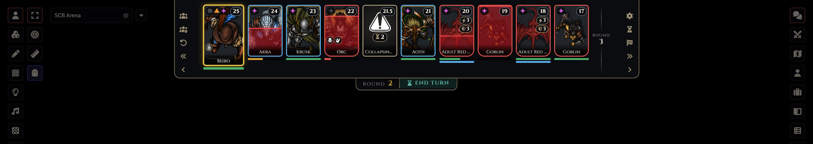
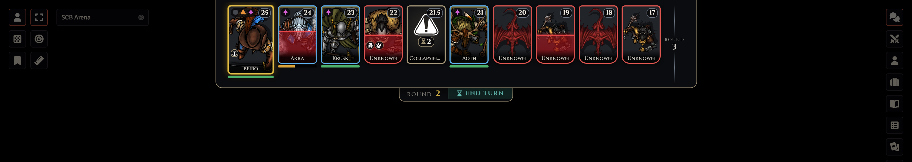
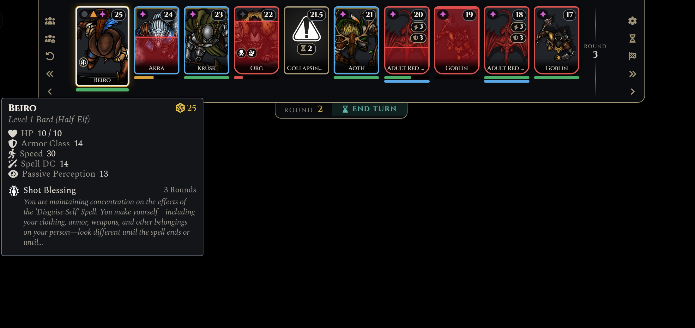

# Simple Combat Bar
A Baldur's Gate 3 style turn-order bar for Dungeons & Dragons 5e on Foundry VTT.

The whole fight at a glance across the top of the screen: who's acting now, who's next, and who has
already gone this round. Portraits fill with red as creatures are hurt, your action economy sits on
your card, and players only ever see as much of an enemy as you allow.

## The Bar

- **Reads like BG3.** The combatant acting now comes first, then everyone still to act this round, a divider for the next round, then those who have already acted.
- **Hangs from the top of the screen**, with the round and an **End Turn** button in a tab beneath it. End Turn shows for whoever owns the combatant acting, and for the GM.
- **Portraits fill with blood** As hit points are lost.
- **Cards or medallions.** Tall portrait cards by default, or round medallions.
- **Fits the window.** Portraits shrink to fit a crowded fight, and the bar scrolls sideways once
  they're as small as they go.

### What Players See

Players see a combat as soon as it exists, so they can roll initiative before it starts.

- **Names** follow each token's own name setting, or you can show or hide them all.
- **Hit points.** Players see exact hit points for their own characters. For enemies, the default is
  just how wounded they are (healthy, bloodied, badly wounded), taken from D&D 5e's own Bloodied and
  Dead conditions, and the red fill moves in steps rather than showing an exact number.
- **Enemy initiative** can be hidden.
- **Enemies can be revealed as they act**, so players don't see the whole enemy side in round one.

## Turn Tools

### Action Pips
The acting combatant's card shows their **Action** (green circle), **Bonus Action** (orange triangle)
and **Reaction** (magenta sparkle); every other card shows its Reaction, since that one is spent on
other people's turns.

- Using an ability spends the pip it needs, and they all come back at the start of that
  combatant's turn.
- The owner or GM can click a pip to flip it.
- With **midi-qol** active, midi-qol keeps track and the pips follow it.
- With **BG3 Inspired HUD** active (and no midi-qol), the bar marks used Bonus Actions and
  Reactions the way midi-qol does, so the HUD greys them out too.

### Initiative
Owners get a d20 on their card until they've rolled. You choose who gets D&D 5e's roll window.

### Group Turns
Optional, and off by default. With **Group Turns** set to *Shared frame (group turns)*, allies (or
enemies) next to each other in the initiative order share one turn, as in Baldur's Gate 3:

- Any of them can act, in any order: click your waiting teammate's portrait to act with them now.
- Each ends their own part with End Turn, and the turn moves on once all of them are done.

### Add Event
Put timed events into the initiative order: a collapsing ceiling, reinforcements arriving, a spell
running out. Give it a name, an initiative (19.5 slots it between two combatants), a duration in
rounds, and an image. It counts down on its card and is removed when its time is up, with a
whisper to the GM. Your recent events are kept as one-click presets.

### Late Arrivals
Some things join a fight part-way through, like a Death Tyrant bursting out of the canal on
initiative count 0 of round 2. Add it to the combat now, give it its initiative (−0.01 means count 0,
losing ties), then right-click its portrait and choose **Arrives in Round…**.

- Until then its turns are skipped, and players don't see it. You see it greyed out, with the round
  it arrives in.
- When its turn comes up in that round, it and its token are revealed, and you get a whisper to
  read the boxed text.
- **Arrive Now** brings it in early. Events can arrive late too: set **Arrives in round** when you
  add one.

## On Each Card

- **Status effects**, the same icons the token shows on the map, each in a ring that drains as its
  duration runs out. The owner or GM can right-click one to remove it.
- **Legendary actions and resistances** left, on legendary creatures. D&D 5e spends and refills
  them itself; click one to spend it by hand, Shift-click to give it back.
- **A second bar** under the hit points, for any resource with a maximum: legendary actions, spell
  slots, a class resource. Pick it in **Configure Trackers**.

Hover a portrait for the details: hit points, armor class, speed, spell DC, passive Perception,
and every effect with its time left and its description. You choose which values the tooltip shows.

## GM Controls

The GM's controls are tabs on either end of the bar, drawn like the D&D 5e character sheet's:
roll for everyone or for NPCs, reset initiative, step back a turn or a round, start and end the
combat, add an event, and open the settings. Right-click a portrait to make it the current turn,
ping or pan to its token, re-roll or clear its initiative, hide it, mark it defeated, or remove it.

Keyboard: **Shift+M** ends the turn and **Shift+N** goes back one (GM).

## Settings

Everything is under **Game Settings → Configure Settings → Simple Combat Bar**, including who sees
names, hit points, effect descriptions and initiative, the portrait style and size, whether the
sidebar collapses and the D&D calendar hides during combat, and the action pips, legendary badges
and effect icons.

Turn on **XP Summary When Combat Ends** and ending a combat whispers the GM a card listing the
defeated enemies and their total XP, with dnd5e's Award button to hand it out (the same as typing
`/award`). The players' own creatures and friendly NPCs aren't counted.

## Support Information

### Supported Versions
| Component | Version |
|------------|------------|
| Foundry VTT | v14 |
| D&D 5e System | 6.0+ |
| Verified On | Foundry 14.368 / D&D 5e 6.0.5 |

### For Developers
Other modules can add portrait styles and read the bar through its API: see
[docs/API.md](docs/API.md). To work on the module itself, see [CONTRIBUTING.md](CONTRIBUTING.md).

### Reporting Issues
When reporting an issue, please fill in the issue form [here](https://github.com/IainFielding/Simple-Combat-Bar/issues).
